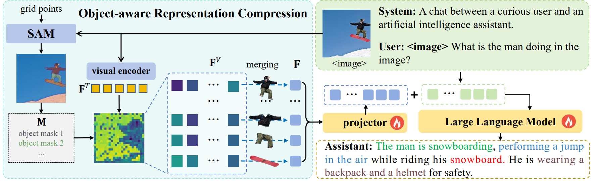
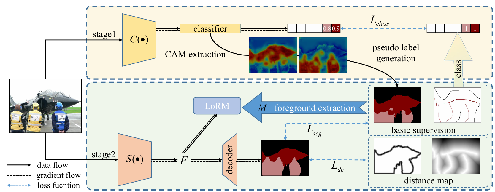
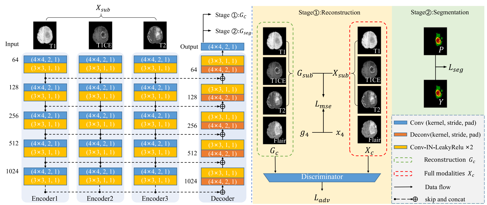

My name is Xinliang Zhang (张心亮). I am currently a PhD student at the Molecular Imaging and Medical Intelligence Lab [MILab](wiki.milab.wiki), supervised by [Yanye Lu](https://nbic.pku.edu.cn/rcdw/kyry/jzyjy/b33cd89d98fb414681de8b103b36a198.htm) (卢闫晔).

My research instresets include image segmentation, object detection, and multimodal large language models. I am also interested in the application of AI in medical imaging.

## Publications
\#: Equal Contribution; \*: Corresponding Author

### Preprint

  

[AdaTok: Adaptive Token Compression with Object-Aware Representations for Efficient Multimodal LLMs](https://arxiv.org/abs/2511.14169)  
**arXiv 18 Nov 2025**  
**Xinliang Zhang**, Lei Zhu, Hangzhou He, Shuang Zeng, Ourui Fu, Jiakui Hu, Zhengjian Yao, Yanye Lu*

  

  

### Conference Papers

  

[Scribble Hides Class: Promoting Scribble-Based Weakly-Supervised Semantic Segmentation with Its Class Label](https://doi.org/10.1609/aaai.v38i7.28563)  
**AAAI 2024**, (***CCF-A***) [[poster](https://ojs.aaai.org/index.php/AAAI/article/view/28563/29095)]
[[pdf](https://arxiv.org/abs/2402.17555)] [[doi](https://doi.org/10.1609/aaai.v38i7.28563)] [[code](https://github.com/Zxl19990529/Class-driven-Scribble-Promotion-Network)]  
**Xinliang Zhang #, Lei Zhu #**, Hangzhou He, Lujia Jin, Yanye Lu* 

  

  

  

### Journal Papers

  

[Generative learning-based lightweight MRI brain tumor segmentation with missing modalities](https://www.sciencedirect.com/science/article/abs/pii/S0957417424023455)  
  **Expert Systems with Applications** ,(***IF=7.5***) [doi](https://doi.org/10.1016/j.eswa.2024.125478)  
  **Xinliang Zhang**,  Qian Chen, Hangzhou He, Lei Zhu, Zhaoheng Xie, Yanye Lu*, Fangxiao Cheng*
  
  

  
<!-- 

   -->

  

### Book Chapter

- **Learning-Based Material Decomposition for Spectral X-Ray Imaging,** 

  **Xinliang Zhang#, Jiakui Hu#**, Yanye Lu*,
  
  **Deep Learning for Advanced X-ray Detection and Imaging Applications. Springer, Cham, 87-105. (Book Chapter)** [[doi](https://doi.org/10.1007/978-3-031-75653-5_5)] 